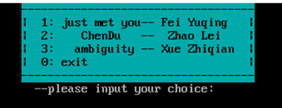
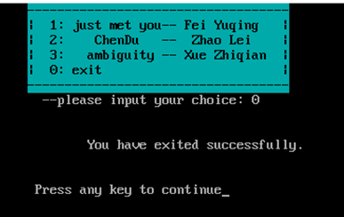
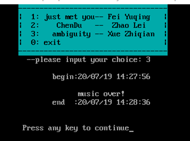
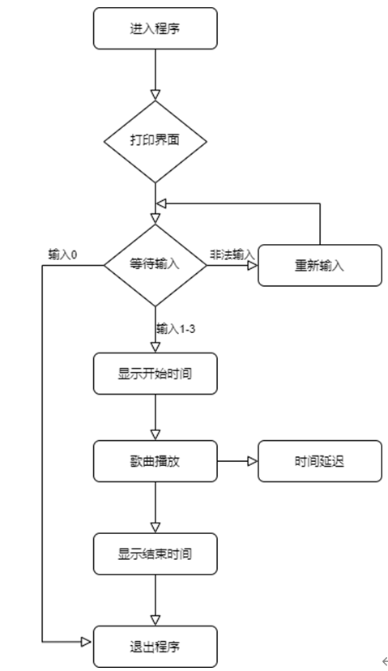

# MP3

MP3 implemented in assembly language

# 目标程序

用汇编语言实现一个音乐播放器，并支持点歌

# Overview

乐曲是按照一定的高低、长短和强弱关系组成的音调，在一首乐曲中，每个音符的音高和音长与频率和节拍有关，因此我们要分别为3首要演奏的乐曲定义一个频率表和一个节拍时间表。

利用8253/54定时器来驱动扬声器，在8253/54中的43端口送一个控制字0B6H，该控制字对定时器2进行初始化，使定时器2准备接收计数初值。在8253/54中的42H端口装入一个16位的计数值，以建立将要产生的发声频率。把输出端口61H的0、1两位置1，发出声音。 

输入不同的数字，要播放相应的音乐。因此我们要利用输入的数字来获取歌曲的频率表地址和节拍时间表地址来播放对应音乐，利用直接定址表即可迎刃而解。

在CMOS RAM中存放着当前的时间，秒、分、时、日、月、年分别存放在0，2，4，7，8，9的单元中。这些数据以BCD码的方式存放，因此我们若要输出时间还需将他们转换为ASCII码才可正确输出。

更改界面颜色。在内存地址空间中，B8000H~BFFFFH共32KB的空间，为80*25彩色字符模式的显示缓冲区。一个字符占两个字节的存储空间，低位字节存储字符的ASCII码，高位字节存储字符的属性。属性字节的格式：7：BL闪烁  6、5、4：RGB背景色 3：I高亮 2、1、0：RGB前景色。更改属性字节即可更改界面颜色。

# 效果预览

## 初始界面

## 开始播放

## 结束播放

# 流程图

